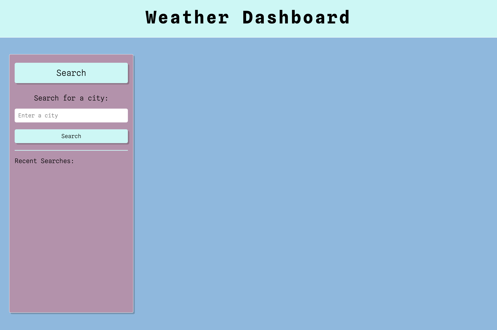
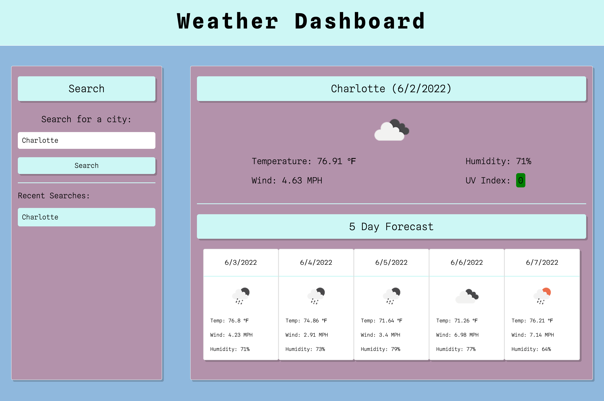

# Weather-dashboard

## Table of Content 

- [Description](#description)
- [Usage](#usage)
- [Visuals](#visuals)
- [Resources](#resources)
- [Author and Acknowledgement](#author-and-acknowledgement)

## Description 

This is a weather dashboard that allow a user to input any city name that they desired to look up.

When a user search for a city, they will be display with the current weather in that city and will also display the next five day forecast weather.

For each search the user inputted, it will be saved to local storage and display under the section called recent searches. All the user searches will be there and they can click on the recent searches to look at the weather again, without having to type out the city name again.

## Usage 

How a user would this weather dashboard website 

- Step 1: When the page load, they will see a search bar that can search for a city. User will then input a city that they would like to see for the weather

- Step 2: Once click the search button, they are prompted with the current weather and the next five day forecast

## Visuals 

This is what the user see when the page first loads

This is what the user see after they search for the city and it is save to recent searches section 

## Resources 

-[Live Site](https://vanessaliaw021.github.io/weather-dashboard/)

-[GitHub Repo](https://github.com/VanessaLiaw021/weather-dashboard)

## Author and Acknowledgement

Coded and Design by Vanessa Liaw